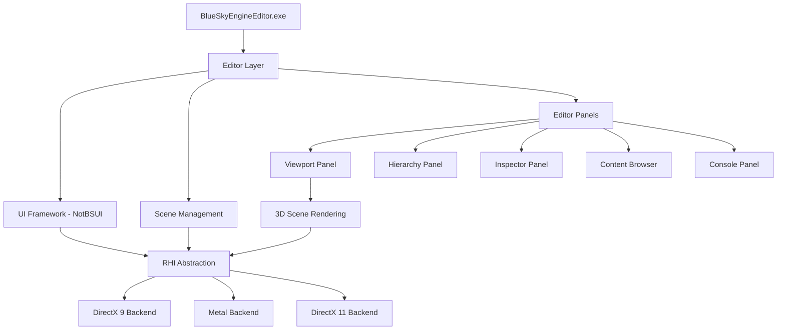
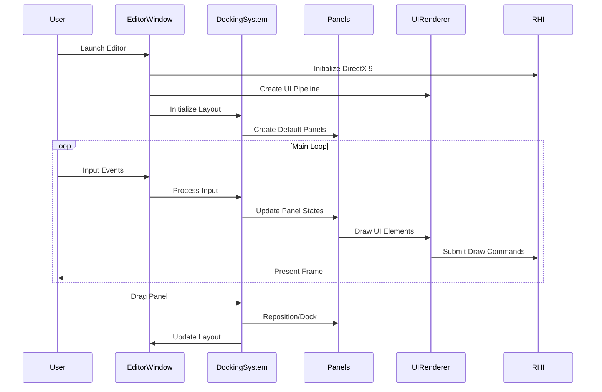

# Design Document: Unreal-Style Editor UI

## Overview

This design document outlines the implementation of a professional Unreal Engine-style UI for the BlueSky Engine Editor. The editor will feature a dockable panel system with viewport, hierarchy, inspector, content browser, and console panels similar to Unreal Engine's layout. The design includes two main objectives: (1) backing up the working DirectX 9 rendering logic from BlueSkyEngine.exe to BlueSky.RHI.Test as a safety measure, and (2) building a comprehensive editor UI system with docking, resizing, and professional styling.

The editor will maintain compatibility with the existing DirectX 9 rendering pipeline on Windows 7 while providing a modern, extensible UI framework. The architecture separates concerns between the rendering backend (RHI), UI rendering system (NotBSUI), and editor-specific UI components, allowing for future enhancements and cross-platform support.

## Architecture

The editor architecture follows a layered approach with clear separation between rendering, UI framework, and editor logic:




## Main Workflow



## Components and Interfaces

### Component 1: DockingSystem

**Purpose**: Manages the layout, docking, and resizing of editor panels

**Interface**:
```csharp
interface IDockingSystem
{
    void Initialize(Vector2 windowSize);
    void AddPanel(IEditorPanel panel, DockPosition position);
    void RemovePanel(IEditorPanel panel);
    void BeginDrag(IEditorPanel panel, Vector2 mousePos);
    void UpdateDrag(Vector2 mousePos);
    void EndDrag();
    void Resize(Vector2 newSize);
    void SaveLayout(string path);
    void LoadLayout(string path);
    IEnumerable<IEditorPanel> GetPanels();
}
```

**Responsibilities**:
- Track all editor panels and their positions
- Handle drag-and-drop docking operations
- Calculate panel sizes during window resize
- Persist and restore layout configurations
- Provide visual feedback during docking operations


### Component 2: IEditorPanel

**Purpose**: Base interface for all editor panels (viewport, hierarchy, inspector, etc.)

**Interface**:
```csharp
interface IEditorPanel
{
    string Title { get; }
    Vector2 Position { get; set; }
    Vector2 Size { get; set; }
    Vector2 MinSize { get; }
    bool IsVisible { get; set; }
    bool IsFocused { get; set; }
    PanelFlags Flags { get; }
    
    void OnUpdate(float deltaTime);
    void OnDraw(UIRenderer renderer);
    void OnResize(Vector2 newSize);
    void OnFocus();
    void OnBlur();
    bool OnInput(InputEvent inputEvent);
}

[Flags]
enum PanelFlags
{
    None = 0,
    Dockable = 1 << 0,
    Resizable = 1 << 1,
    Closable = 1 << 2,
    HasTitleBar = 1 << 3,
    Default = Dockable | Resizable | Closable | HasTitleBar
}
```

**Responsibilities**:
- Render panel content
- Handle panel-specific input
- Manage panel state (focus, visibility)
- Define minimum size constraints
- Respond to resize events

### Component 3: ViewportPanel

**Purpose**: Renders the 3D scene with camera controls and gizmos

**Interface**:
```csharp
class ViewportPanel : IEditorPanel
{
    public Camera Camera { get; set; }
    public Scene Scene { get; set; }
    public GizmoMode GizmoMode { get; set; }
    public IRHITexture RenderTarget { get; }
    
    void SetCameraMode(CameraMode mode);
    void FocusOnSelection();
    void ToggleWireframe();
    void ToggleGrid();
    Ray ScreenPointToRay(Vector2 screenPos);
}

enum CameraMode
{
    Perspective,
    Orthographic,
    Top,
    Front,
    Side
}

enum GizmoMode
{
    None,
    Translate,
    Rotate,
    Scale
}
```

**Responsibilities**:
- Render 3D scene to offscreen render target
- Display render target as texture in panel
- Handle camera movement (WASD, mouse orbit)
- Render transformation gizmos
- Perform object picking via raycasting
- Display viewport statistics (FPS, draw calls)


### Component 4: HierarchyPanel

**Purpose**: Displays scene hierarchy as a tree view with selection and drag-drop

**Interface**:
```csharp
class HierarchyPanel : IEditorPanel
{
    public Scene Scene { get; set; }
    public IReadOnlyList<Entity> SelectedEntities { get; }
    
    void SelectEntity(Entity entity, bool addToSelection = false);
    void DeselectAll();
    void RenameEntity(Entity entity);
    void DeleteSelected();
    void DuplicateSelected();
    void CreateEntity(string name, Entity parent = null);
}
```

**Responsibilities**:
- Display scene entities in tree structure
- Handle entity selection (single and multi-select)
- Support drag-and-drop reparenting
- Provide context menu for entity operations
- Synchronize selection with other panels
- Filter entities by name or type

### Component 5: InspectorPanel

**Purpose**: Displays and edits properties of selected entities

**Interface**:
```csharp
class InspectorPanel : IEditorPanel
{
    public IReadOnlyList<Entity> SelectedEntities { get; set; }
    
    void DrawComponentProperties(Component component);
    void AddComponent(Type componentType);
    void RemoveComponent(Component component);
    void ResetComponent(Component component);
}
```

**Responsibilities**:
- Display properties of selected entities
- Render appropriate editors for each property type
- Support multi-object editing
- Provide add/remove component functionality
- Show component-specific context menus
- Handle property value changes with undo/redo


### Component 6: ContentBrowserPanel

**Purpose**: Displays project assets with thumbnail previews and import functionality

**Interface**:
```csharp
class ContentBrowserPanel : IEditorPanel
{
    public string CurrentDirectory { get; set; }
    public IReadOnlyList<AssetEntry> SelectedAssets { get; }
    
    void NavigateToDirectory(string path);
    void NavigateUp();
    void RefreshAssets();
    void ImportAsset(string filePath);
    void DeleteAsset(AssetEntry asset);
    void RenameAsset(AssetEntry asset, string newName);
    void CreateFolder(string name);
}

class AssetEntry
{
    public string Name { get; set; }
    public string Path { get; set; }
    public AssetType Type { get; set; }
    public IRHITexture Thumbnail { get; set; }
}

enum AssetType
{
    Folder,
    Scene,
    Mesh,
    Texture,
    Material,
    Script,
    Audio,
    Unknown
}
```

**Responsibilities**:
- Display assets in current directory
- Generate and cache asset thumbnails
- Handle asset import and deletion
- Support drag-and-drop to scene
- Provide asset search and filtering
- Show asset context menus

### Component 7: ConsolePanel

**Purpose**: Displays log messages and allows command execution

**Interface**:
```csharp
class ConsolePanel : IEditorPanel
{
    public IReadOnlyList<LogEntry> Logs { get; }
    public LogLevel FilterLevel { get; set; }
    
    void Log(string message, LogLevel level);
    void Clear();
    void ExecuteCommand(string command);
    void SetFilter(string filter);
}

class LogEntry
{
    public string Message { get; set; }
    public LogLevel Level { get; set; }
    public DateTime Timestamp { get; set; }
}

enum LogLevel
{
    Trace,
    Debug,
    Info,
    Warning,
    Error,
    Fatal
}
```

**Responsibilities**:
- Display log messages with color coding
- Filter logs by level and search text
- Auto-scroll to latest messages
- Execute console commands
- Provide command history and autocomplete
- Export logs to file


## Data Models

### Model 1: DockNode

```csharp
class DockNode
{
    public DockNodeType Type { get; set; }
    public Vector2 Position { get; set; }
    public Vector2 Size { get; set; }
    public DockNode Parent { get; set; }
    public DockNode LeftChild { get; set; }
    public DockNode RightChild { get; set; }
    public IEditorPanel Panel { get; set; }
    public SplitDirection SplitDirection { get; set; }
    public float SplitRatio { get; set; }
}

enum DockNodeType
{
    Root,
    Split,
    Panel
}

enum SplitDirection
{
    Horizontal,
    Vertical
}
```

**Validation Rules**:
- Root node must have at least one child
- Split nodes must have exactly two children
- Panel nodes must have a valid panel reference
- Split ratio must be between 0.1 and 0.9
- Minimum panel size must be respected

### Model 2: EditorLayout

```csharp
class EditorLayout
{
    public string Name { get; set; }
    public DockNode RootNode { get; set; }
    public Dictionary<string, PanelState> PanelStates { get; set; }
}

class PanelState
{
    public string PanelType { get; set; }
    public Vector2 Position { get; set; }
    public Vector2 Size { get; set; }
    public bool IsVisible { get; set; }
    public Dictionary<string, object> CustomData { get; set; }
}
```

**Validation Rules**:
- Layout name must be non-empty
- Root node must be valid
- Panel states must reference existing panel types
- Custom data must be serializable


### Model 3: RenderingBackupData

```csharp
class RenderingBackupData
{
    public string SourceFile { get; set; }
    public string BackupFile { get; set; }
    public DateTime BackupTimestamp { get; set; }
    public string BackupHash { get; set; }
    public RenderingBackendType Backend { get; set; }
}

enum RenderingBackendType
{
    DirectX9,
    DirectX11,
    Metal,
    Vulkan
}
```

**Validation Rules**:
- Source file must exist
- Backup file path must be valid
- Backup hash must match file content
- Backend type must be supported

## Algorithmic Pseudocode

### Main Editor Initialization Algorithm

```pascal
ALGORITHM InitializeEditor(windowOptions)
INPUT: windowOptions of type WindowOptions
OUTPUT: editorState of type EditorState

BEGIN
  ASSERT windowOptions.Width > 0 AND windowOptions.Height > 0
  
  // Step 1: Create window and RHI device
  window ← WindowFactory.Create(windowOptions)
  backend ← DetectRenderingBackend()
  rhiDevice ← RHIDevice.Create(backend, window)
  swapchain ← rhiDevice.CreateSwapchain(window, PresentMode.Vsync)
  
  ASSERT rhiDevice ≠ NULL AND swapchain ≠ NULL
  
  // Step 2: Initialize UI rendering system
  uiPipeline ← CreateUIPipeline(rhiDevice)
  uiRenderer ← UIRenderer(rhiDevice, uiPipeline)
  fontAtlas ← FontAtlas(rhiDevice, GetSystemFont(), 16)
  uiRenderer.GlobalFontAtlas ← fontAtlas
  
  // Step 3: Initialize docking system
  dockingSystem ← DockingSystem()
  dockingSystem.Initialize(window.Size)
  
  // Step 4: Create default panels
  viewportPanel ← ViewportPanel()
  hierarchyPanel ← HierarchyPanel()
  inspectorPanel ← InspectorPanel()
  contentBrowserPanel ← ContentBrowserPanel()
  consolePanel ← ConsolePanel()
  
  // Step 5: Setup default layout
  dockingSystem.AddPanel(viewportPanel, DockPosition.Center)
  dockingSystem.AddPanel(hierarchyPanel, DockPosition.Left)
  dockingSystem.AddPanel(inspectorPanel, DockPosition.Right)
  dockingSystem.AddPanel(contentBrowserPanel, DockPosition.Bottom)
  dockingSystem.AddPanel(consolePanel, DockPosition.BottomRight)
  
  // Step 6: Initialize scene and rendering
  world ← World()
  scene ← Scene()
  renderer ← CreateRenderer(backend, rhiDevice)
  
  editorState ← EditorState(window, rhiDevice, swapchain, uiRenderer, 
                            dockingSystem, world, scene, renderer)
  
  ASSERT editorState.IsValid()
  
  RETURN editorState
END
```

**Preconditions**:
- windowOptions is non-null and contains valid dimensions
- System has required graphics API support (DirectX 9 on Windows 7)
- Font files are accessible

**Postconditions**:
- Editor window is created and visible
- All panels are initialized and docked
- Rendering pipeline is ready
- Returns valid EditorState object

**Loop Invariants**: N/A (no loops in main initialization)


### Docking Algorithm

```pascal
ALGORITHM ProcessDocking(draggedPanel, mousePosition, dockingSystem)
INPUT: draggedPanel of type IEditorPanel
       mousePosition of type Vector2
       dockingSystem of type DockingSystem
OUTPUT: dockResult of type DockResult

BEGIN
  ASSERT draggedPanel ≠ NULL
  ASSERT dockingSystem ≠ NULL
  
  // Step 1: Find target panel under mouse
  targetPanel ← NULL
  FOR each panel IN dockingSystem.GetPanels() DO
    ASSERT panel.IsVisible = true IMPLIES panel.Size.X > 0 AND panel.Size.Y > 0
    
    IF panel ≠ draggedPanel AND panel.ContainsPoint(mousePosition) THEN
      targetPanel ← panel
      BREAK
    END IF
  END FOR
  
  // Step 2: Determine dock zone if target found
  IF targetPanel ≠ NULL THEN
    dockZone ← CalculateDockZone(targetPanel, mousePosition)
    
    // Step 3: Create visual feedback
    highlightRect ← CalculateHighlightRect(targetPanel, dockZone)
    DrawDockHighlight(highlightRect)
    
    // Step 4: Return dock result
    RETURN DockResult(targetPanel, dockZone, highlightRect)
  ELSE
    // No valid dock target
    RETURN DockResult(NULL, DockZone.None, Rectangle.Empty)
  END IF
END
```

**Preconditions**:
- draggedPanel is a valid panel being dragged
- mousePosition is within window bounds
- dockingSystem contains at least one panel

**Postconditions**:
- Returns valid DockResult indicating where panel can be docked
- Visual feedback is displayed if valid dock target exists
- No modifications to actual panel layout (preview only)

**Loop Invariants**:
- All checked panels have valid positions and sizes
- targetPanel remains NULL or points to valid panel


### Rendering Backup Algorithm

```pascal
ALGORITHM BackupRenderingLogic(sourceProject, targetProject)
INPUT: sourceProject of type string (path to BlueSkyEngine)
       targetProject of type string (path to BlueSky.RHI.Test)
OUTPUT: backupResult of type BackupResult

BEGIN
  ASSERT DirectoryExists(sourceProject)
  ASSERT DirectoryExists(targetProject)
  
  // Step 1: Identify rendering files to backup
  renderingFiles ← []
  renderingFiles.Add("BlueSkyEngine/RHI/DirectX9/D3D9Device.cs")
  renderingFiles.Add("BlueSkyEngine/RHI/DirectX9/D3D9CommandBuffer.cs")
  renderingFiles.Add("BlueSkyEngine/RHI/DirectX9/D3D9Swapchain.cs")
  renderingFiles.Add("BlueSkyEngine/RHI/DirectX9/D3D9Texture.cs")
  renderingFiles.Add("BlueSkyEngine/RHI/DirectX9/D3D9Buffer.cs")
  renderingFiles.Add("BlueSkyEngine/RHI/DirectX9/D3D9Pipeline.cs")
  
  backupManifest ← []
  
  // Step 2: Copy each file with verification
  FOR each sourceFile IN renderingFiles DO
    ASSERT FileExists(sourceFile)
    
    sourcePath ← Path.Combine(sourceProject, sourceFile)
    targetPath ← Path.Combine(targetProject, "Backup", Path.GetFileName(sourceFile))
    
    // Create backup directory if needed
    IF NOT DirectoryExists(Path.GetDirectoryName(targetPath)) THEN
      CreateDirectory(Path.GetDirectoryName(targetPath))
    END IF
    
    // Copy file
    CopyFile(sourcePath, targetPath)
    
    // Verify copy
    sourceHash ← ComputeFileHash(sourcePath)
    targetHash ← ComputeFileHash(targetPath)
    
    ASSERT sourceHash = targetHash
    
    // Record in manifest
    backupEntry ← BackupEntry(sourceFile, targetPath, DateTime.Now, sourceHash)
    backupManifest.Add(backupEntry)
  END FOR
  
  // Step 3: Save backup manifest
  manifestPath ← Path.Combine(targetProject, "Backup", "backup_manifest.json")
  SaveManifest(backupManifest, manifestPath)
  
  ASSERT FileExists(manifestPath)
  
  RETURN BackupResult(true, backupManifest.Count, manifestPath)
END
```

**Preconditions**:
- Source project directory exists and contains rendering files
- Target project directory exists and is writable
- Sufficient disk space for backup files

**Postconditions**:
- All rendering files are copied to backup location
- Each backup file hash matches source file hash
- Backup manifest is created with metadata
- Returns success result with file count

**Loop Invariants**:
- All previously processed files have been successfully backed up
- All backup file hashes match their source file hashes
- Backup manifest contains entries for all processed files


### Panel Resize Algorithm

```pascal
ALGORITHM ResizePanels(dockNode, newSize)
INPUT: dockNode of type DockNode
       newSize of type Vector2
OUTPUT: void (modifies dockNode tree in place)

BEGIN
  ASSERT dockNode ≠ NULL
  ASSERT newSize.X > 0 AND newSize.Y > 0
  
  // Base case: Panel node
  IF dockNode.Type = DockNodeType.Panel THEN
    oldSize ← dockNode.Size
    dockNode.Size ← newSize
    
    // Enforce minimum size
    IF dockNode.Size.X < dockNode.Panel.MinSize.X THEN
      dockNode.Size.X ← dockNode.Panel.MinSize.X
    END IF
    IF dockNode.Size.Y < dockNode.Panel.MinSize.Y THEN
      dockNode.Size.Y ← dockNode.Panel.MinSize.Y
    END IF
    
    // Notify panel of resize
    dockNode.Panel.OnResize(dockNode.Size)
    RETURN
  END IF
  
  // Recursive case: Split node
  IF dockNode.Type = DockNodeType.Split THEN
    ASSERT dockNode.LeftChild ≠ NULL AND dockNode.RightChild ≠ NULL
    ASSERT dockNode.SplitRatio >= 0.1 AND dockNode.SplitRatio <= 0.9
    
    IF dockNode.SplitDirection = SplitDirection.Horizontal THEN
      // Split horizontally (left/right)
      leftWidth ← newSize.X * dockNode.SplitRatio
      rightWidth ← newSize.X - leftWidth
      
      leftSize ← Vector2(leftWidth, newSize.Y)
      rightSize ← Vector2(rightWidth, newSize.Y)
      
      ResizePanels(dockNode.LeftChild, leftSize)
      ResizePanels(dockNode.RightChild, rightSize)
      
      // Update positions
      dockNode.RightChild.Position ← dockNode.Position + Vector2(leftWidth, 0)
    ELSE
      // Split vertically (top/bottom)
      topHeight ← newSize.Y * dockNode.SplitRatio
      bottomHeight ← newSize.Y - topHeight
      
      topSize ← Vector2(newSize.X, topHeight)
      bottomSize ← Vector2(newSize.X, bottomHeight)
      
      ResizePanels(dockNode.LeftChild, topSize)
      ResizePanels(dockNode.RightChild, bottomSize)
      
      // Update positions
      dockNode.RightChild.Position ← dockNode.Position + Vector2(0, topHeight)
    END IF
  END IF
END
```

**Preconditions**:
- dockNode is a valid node in the docking tree
- newSize has positive dimensions
- Split nodes have valid children and split ratios

**Postconditions**:
- All panels in the tree are resized proportionally
- Minimum panel sizes are respected
- Panel positions are updated correctly
- All panels receive OnResize notifications

**Loop Invariants**: N/A (recursive algorithm, not iterative)


## Key Functions with Formal Specifications

### Function 1: DockingSystem.AddPanel()

```csharp
public void AddPanel(IEditorPanel panel, DockPosition position)
```

**Preconditions:**
- `panel` is non-null and implements IEditorPanel
- `panel` is not already added to the docking system
- `position` is a valid DockPosition enum value
- Docking system is initialized

**Postconditions:**
- Panel is added to the docking tree at specified position
- Panel receives OnResize event with calculated size
- Panel is visible and can receive input
- Docking tree remains balanced and valid
- All existing panels maintain their relative positions

**Loop Invariants:** N/A

### Function 2: ViewportPanel.ScreenPointToRay()

```csharp
public Ray ScreenPointToRay(Vector2 screenPos)
```

**Preconditions:**
- `screenPos` is within viewport bounds (0 <= x < width, 0 <= y < height)
- Camera is initialized with valid projection matrix
- Viewport size is greater than zero

**Postconditions:**
- Returns valid Ray with normalized direction
- Ray origin is at camera position
- Ray direction points from camera through screen point
- Ray is in world space coordinates

**Loop Invariants:** N/A

### Function 3: HierarchyPanel.SelectEntity()

```csharp
public void SelectEntity(Entity entity, bool addToSelection = false)
```

**Preconditions:**
- `entity` is non-null and exists in the scene
- Scene is initialized and contains entities
- Panel is visible and active

**Postconditions:**
- If `addToSelection` is false: only `entity` is selected, previous selection cleared
- If `addToSelection` is true: `entity` is added to existing selection
- Selected entities list contains `entity`
- Inspector panel is notified of selection change
- Entity is highlighted in hierarchy view

**Loop Invariants:** N/A


### Function 4: UIRenderer.DrawPanel()

```csharp
public void DrawPanel(IEditorPanel panel, IRHICommandBuffer cmd)
```

**Preconditions:**
- `panel` is non-null and visible
- `cmd` is a valid command buffer in recording state
- UIRenderer is initialized with valid pipeline
- Font atlas is loaded

**Postconditions:**
- Panel background is drawn at panel position
- Panel title bar is drawn if HasTitleBar flag is set
- Panel content is drawn via panel.OnDraw()
- All draw commands are recorded to command buffer
- No state changes affect subsequent rendering

**Loop Invariants:** N/A

### Function 5: ContentBrowserPanel.ImportAsset()

```csharp
public void ImportAsset(string filePath)
```

**Preconditions:**
- `filePath` is non-null and non-empty
- File exists at `filePath`
- File format is supported (mesh, texture, audio, etc.)
- Project assets directory is writable

**Postconditions:**
- Asset is copied to project assets directory
- Asset metadata is generated and saved
- Thumbnail is generated for visual assets
- Asset appears in content browser
- Asset is ready for use in scene

**Loop Invariants:** N/A

## Example Usage

```csharp
// Example 1: Initialize editor with default layout
var options = WindowOptions.Default;
options.Title = "BlueSky Engine Editor";
options.Width = 1920;
options.Height = 1080;

var editorState = InitializeEditor(options);

// Example 2: Add custom panel to docking system
var customPanel = new MyCustomPanel
{
    Title = "Custom Tool",
    MinSize = new Vector2(200, 150)
};
editorState.DockingSystem.AddPanel(customPanel, DockPosition.Right);

// Example 3: Handle entity selection
editorState.HierarchyPanel.SelectEntity(selectedEntity);
var properties = editorState.InspectorPanel.GetProperties(selectedEntity);

// Example 4: Perform object picking in viewport
var mousePos = Input.GetMousePosition();
var ray = editorState.ViewportPanel.ScreenPointToRay(mousePos);
var hitEntity = editorState.Scene.Raycast(ray);
if (hitEntity != null)
{
    editorState.HierarchyPanel.SelectEntity(hitEntity);
}

// Example 5: Save and load layout
editorState.DockingSystem.SaveLayout("Layouts/MyLayout.json");
// ... later ...
editorState.DockingSystem.LoadLayout("Layouts/MyLayout.json");

// Example 6: Backup rendering logic
var backupResult = BackupRenderingLogic(
    "BlueSkyEngine",
    "BlueSky.RHI.Test"
);
Console.WriteLine($"Backed up {backupResult.FileCount} files");
```


## Correctness Properties

*A property is a characteristic or behavior that should hold true across all valid executions of a system—essentially, a formal statement about what the system should do. Properties serve as the bridge between human-readable specifications and machine-verifiable correctness guarantees.*

### Property 1: Panel Layout Consistency

*For any* docking system state, all panels must have positions and sizes that fit within the window bounds.

**Validates: Requirements 3.4**

### Property 2: Minimum Size Enforcement

*For any* panel resize operation, the resulting panel size must be greater than or equal to the panel's minimum size in both dimensions.

**Validates: Requirements 3.1**

### Property 3: Minimum Size Conflict Resolution

*For any* window resize that would force a panel below its minimum size, the panel must be clamped to its minimum size and adjacent panels must be adjusted to compensate.

**Validates: Requirements 3.3**

### Property 4: Selection Synchronization

*For any* entity selection in the hierarchy panel, the same entities must appear in the inspector panel's selection.

**Validates: Requirements 5.4**

### Property 5: Docking Tree Validity

*For any* split node in the docking tree, it must have exactly two non-null children and a split ratio between 0.1 and 0.9.

**Validates: Requirements 2.5**

### Property 6: Panel Addition Correctness

*For any* panel and dock position, adding the panel to the docking system must result in the panel being inserted at the specified position in the docking tree.

**Validates: Requirements 2.1**

### Property 7: Panel Removal Redistribution

*For any* panel removal operation, the space previously occupied by the removed panel must be redistributed to remaining panels.

**Validates: Requirements 2.6**

### Property 8: Proportional Resize

*For any* window resize operation, all panels must be resized proportionally according to their split ratios while respecting minimum size constraints.

**Validates: Requirements 2.4**

### Property 9: Backup File Integrity

*For any* file in the backup manifest, the hash of the backed up file must equal the hash of the original source file.

**Validates: Requirements 10.3**

### Property 10: Backup Manifest Completeness

*For any* backup operation, the generated manifest must contain entries for all DirectX 9 rendering files with paths, timestamps, and hashes.

**Validates: Requirements 10.4**

### Property 11: Render Target Dimension Matching

*For any* viewport panel, the render target dimensions must match the panel dimensions.

**Validates: Requirements 4.2**

### Property 12: Viewport Selection Notification

*For any* entity selected via viewport click, the hierarchy panel must be notified of the selection.

**Validates: Requirements 4.6**

### Property 13: Single Selection Exclusivity

*For any* entity click in the hierarchy panel (without Ctrl), only that entity must be selected and all others must be deselected.

**Validates: Requirements 5.2**

### Property 14: Multi-Selection Addition

*For any* Ctrl+click on an entity in the hierarchy panel, the entity must be added to the current selection without clearing existing selections.

**Validates: Requirements 5.3**

### Property 15: Entity Reparenting

*For any* drag-drop operation of an entity onto another entity in the hierarchy panel, the dragged entity's parent must be updated to the target entity.

**Validates: Requirements 5.5**

### Property 16: Hierarchy Filtering

*For any* filter string applied to the hierarchy panel, only entities whose names contain the filter string must be displayed.

**Validates: Requirements 5.7**

### Property 17: Property Display Completeness

*For any* selected entity, the inspector panel must display all properties of that entity.

**Validates: Requirements 6.1**

### Property 18: Immediate Property Updates

*For any* property value change in the inspector panel, the corresponding entity property must be updated immediately.

**Validates: Requirements 6.2**

### Property 19: Component Addition

*For any* component type added via the inspector panel, a new component of that type must be created on the selected entity.

**Validates: Requirements 6.5**

### Property 20: Component Removal

*For any* component removed via the inspector panel, that component must be deleted from the entity.

**Validates: Requirements 6.6**

### Property 21: Content Browser Navigation

*For any* folder double-click in the content browser, the current directory must be updated to that folder's path.

**Validates: Requirements 7.2**

### Property 22: Parent Directory Navigation

*For any* "up" button click in the content browser, the current directory must be updated to the parent directory.

**Validates: Requirements 7.3**

### Property 23: Asset Import Integrity

*For any* file imported via the content browser, the file must be copied to the project assets directory and metadata must be generated.

**Validates: Requirements 7.4**

### Property 24: Asset Deletion

*For any* asset deleted via the content browser, the file must be removed from disk.

**Validates: Requirements 7.5**

### Property 25: Asset Renaming

*For any* asset renamed via the content browser, both the file name and metadata must be updated to reflect the new name.

**Validates: Requirements 7.6**

### Property 26: Thumbnail Generation

*For any* visual asset (texture, mesh) in the content browser, a thumbnail must be generated and cached.

**Validates: Requirements 7.7**

### Property 27: Asset Filtering

*For any* filter applied to the content browser, only assets matching the filter criteria (name and/or type) must be displayed.

**Validates: Requirements 7.8**

### Property 28: Log Color Coding

*For any* log message displayed in the console panel, the color must correspond to the log level.

**Validates: Requirements 8.1**

### Property 29: Command Execution

*For any* command entered in the console panel, the command must be executed and the result must be displayed.

**Validates: Requirements 8.2**

### Property 30: Command History Navigation

*For any* up arrow press in the console panel, the previous command in history must be displayed in the input field.

**Validates: Requirements 8.3**

### Property 31: Log Level Filtering

*For any* log level filter applied to the console panel, only log messages at or above that level must be displayed.

**Validates: Requirements 8.4**

### Property 32: Log Text Filtering

*For any* search text filter applied to the console panel, only log messages containing that text must be displayed.

**Validates: Requirements 8.5**

### Property 33: Console Auto-Scroll

*For any* new log message added to the console panel, the scroll position must be updated to show the latest message.

**Validates: Requirements 8.6**

### Property 34: Layout Serialization Round-Trip

*For any* valid docking layout, saving then loading the layout must produce an equivalent layout with all panels in the same positions and all custom data preserved.

**Validates: Requirements 9.1, 9.2, 9.5**

### Property 35: Layout Validation

*For any* layout file loaded by the docking system, the file structure must be validated before deserialization.

**Validates: Requirements 9.4**

### Property 36: Focus Exclusivity

*For any* editor state, at most one panel must be focused.

**Validates: Requirements 11.5**

### Property 37: Focus Assignment

*For any* panel click, that panel must become the focused panel.

**Validates: Requirements 11.1**

### Property 38: Keyboard Input Routing

*For any* keyboard input event, the input must be routed to the currently focused panel.

**Validates: Requirements 11.2**

### Property 39: Input Routing Priority

*For any* key press, the input must be routed to the focused panel first, and only to global handlers if the panel does not consume it.

**Validates: Requirements 11.3**

### Property 40: Mouse Event Routing

*For any* mouse movement, the mouse event must be routed to the panel under the cursor.

**Validates: Requirements 11.4**

### Property 41: Path Traversal Prevention

*For any* file path provided for asset import, paths containing traversal sequences (e.g., "..", absolute paths outside project) must be rejected.

**Validates: Requirements 14.1**

### Property 42: Layout File Validation

*For any* layout file loaded, malformed or malicious file structures must be rejected before deserialization.

**Validates: Requirements 14.2**

### Property 43: Command Input Sanitization

*For any* console command input, the input must be validated and sanitized before execution.

**Validates: Requirements 14.3**

### Property 44: Asset Import Directory Restriction

*For any* asset import operation, files outside the designated project directories must be rejected.

**Validates: Requirements 14.4**

### Property 45: Asset Size Limits

*For any* asset import operation, files exceeding the maximum size limit must be rejected.

**Validates: Requirements 14.5**

### Property 46: Command Whitelisting

*For any* console command, commands not in the whitelist must be rejected.

**Validates: Requirements 14.6**


## Error Handling

### Error Scenario 1: RHI Initialization Failure

**Condition**: DirectX 9 device creation fails on Windows 7 (missing drivers, incompatible hardware)

**Response**: 
- Log detailed error message with device capabilities
- Display user-friendly error dialog
- Attempt fallback to software renderer if available
- Provide troubleshooting steps (update drivers, check DirectX version)

**Recovery**: 
- Exit gracefully with error code
- Save crash log to disk
- Do not corrupt user project files

### Error Scenario 2: Panel Minimum Size Violation

**Condition**: Window resize would force panel below minimum size

**Response**:
- Clamp panel size to minimum
- Adjust adjacent panels to compensate
- Maintain split ratios where possible
- Prevent window from being resized below minimum viable size

**Recovery**:
- Recalculate layout with constraints
- Ensure all panels remain visible and functional

### Error Scenario 3: Asset Import Failure

**Condition**: Asset file is corrupted, unsupported format, or too large

**Response**:
- Display error message with specific failure reason
- Log import attempt with file details
- Do not add partial/corrupted asset to project
- Suggest alternative formats or tools

**Recovery**:
- Rollback any partial import operations
- Clean up temporary files
- Content browser remains in consistent state

### Error Scenario 4: Layout Load Failure

**Condition**: Layout file is missing, corrupted, or incompatible version

**Response**:
- Log warning about layout load failure
- Fall back to default layout
- Notify user that custom layout could not be loaded
- Offer to reset layout to default

**Recovery**:
- Initialize default panel arrangement
- Save new default layout
- Continue editor operation normally

### Error Scenario 5: Backup Operation Failure

**Condition**: Insufficient disk space, permission denied, or source files missing

**Response**:
- Display detailed error message
- Log which files failed to backup
- Do not proceed with operations that depend on backup
- Suggest user actions (free space, check permissions)

**Recovery**:
- Abort backup operation cleanly
- Do not leave partial backups
- Maintain original files unchanged


## Testing Strategy

### Unit Testing Approach

Unit tests will focus on individual components in isolation:

**DockingSystem Tests**:
- Test panel addition and removal
- Verify split ratio calculations
- Test minimum size enforcement
- Validate tree structure after operations
- Test layout serialization/deserialization

**Panel Tests**:
- Test each panel type independently
- Verify resize behavior
- Test input handling
- Validate state management
- Test panel-specific operations (selection, filtering, etc.)

**Backup System Tests**:
- Test file copying with various scenarios
- Verify hash calculation and comparison
- Test manifest generation
- Validate error handling for missing files
- Test rollback on partial failure

**Coverage Goals**: Aim for 80%+ code coverage on core systems (docking, panels, backup)

### Property-Based Testing Approach

Property-based tests will verify invariants across random inputs:

**Property Test Library**: fast-check (for C# via FsCheck or similar)

**Properties to Test**:
1. Panel layout always fits within window bounds (Property 1)
2. Minimum sizes are always respected (Property 2)
3. Docking tree remains valid after any sequence of operations (Property 4)
4. Backup hashes always match source files (Property 5)
5. Split ratios remain in valid range [0.1, 0.9] (Property 4)

**Test Generators**:
- Random panel configurations
- Random window resize sequences
- Random docking operations
- Random file content for backup testing

### Integration Testing Approach

Integration tests will verify component interactions:

**Editor Initialization Flow**:
- Test complete editor startup sequence
- Verify all panels are created and docked
- Test RHI initialization with actual DirectX 9
- Validate UI rendering pipeline

**Panel Interaction Tests**:
- Test selection synchronization between hierarchy and inspector
- Verify viewport picking updates hierarchy selection
- Test drag-and-drop from content browser to viewport
- Validate console command execution affects editor state

**Layout Persistence Tests**:
- Save layout, restart editor, verify layout restored
- Test layout migration between versions
- Verify custom panel states are preserved

**Backup Integration Tests**:
- Perform full backup operation
- Verify all files are copied correctly
- Test restoration from backup
- Validate backup doesn't interfere with running editor


## Performance Considerations

### Rendering Performance

**Target**: Maintain 60 FPS with multiple panels and 3D viewport

**Optimizations**:
- Use offscreen render targets for viewport to avoid re-rendering unchanged content
- Batch UI draw calls to minimize state changes
- Cache font atlas and reuse across frames
- Implement dirty rectangle tracking to only redraw changed panels
- Use hardware-accelerated DirectX 9 rendering (no software fallback for performance)

**Metrics to Monitor**:
- Frame time (target: <16.67ms)
- Draw call count per frame
- GPU memory usage
- UI vertex count

### Memory Management

**Strategies**:
- Pool render targets for viewports to avoid allocation churn
- Reuse command buffers across frames
- Implement asset thumbnail cache with LRU eviction
- Limit log history in console panel (e.g., 10,000 entries)
- Use weak references for panel-to-panel communication

**Metrics to Monitor**:
- Total memory usage
- Allocation rate
- GC pressure
- Texture memory usage

### Docking Performance

**Optimizations**:
- Use spatial partitioning for hit testing during drag operations
- Cache panel bounds to avoid recalculation
- Defer layout recalculation until drag operation completes
- Use incremental updates instead of full tree traversal

**Metrics to Monitor**:
- Drag operation latency
- Layout calculation time
- Panel resize time

### Asset Loading Performance

**Strategies**:
- Load asset thumbnails asynchronously
- Implement progressive loading for large directories
- Cache asset metadata to avoid repeated file I/O
- Use background threads for asset import operations

**Metrics to Monitor**:
- Directory scan time
- Thumbnail generation time
- Asset import time


## Security Considerations

### File System Access

**Threats**:
- Malicious asset files could exploit parser vulnerabilities
- Path traversal attacks during asset import
- Unauthorized access to system files

**Mitigations**:
- Validate all file paths before access
- Restrict asset import to designated project directories
- Sanitize file names to prevent path traversal
- Use safe parsing libraries with bounds checking
- Implement file size limits for imports

### Script Execution

**Threats**:
- Malicious scripts in imported assets
- Code injection through console commands
- Unauthorized system access

**Mitigations**:
- Sandbox script execution environment
- Whitelist allowed console commands
- Validate and sanitize all command inputs
- Require explicit user confirmation for dangerous operations
- Log all script execution for audit trail

### Layout Files

**Threats**:
- Malicious layout files could cause crashes or exploits
- Deserialization vulnerabilities

**Mitigations**:
- Validate layout file structure before loading
- Use safe deserialization with type checking
- Implement version checking for layout files
- Fallback to default layout on validation failure
- Limit layout file size

### Network Operations (Future)

**Threats**:
- Man-in-the-middle attacks on asset downloads
- Unauthorized access to remote assets

**Mitigations**:
- Use HTTPS for all network operations
- Verify asset signatures before import
- Implement authentication for remote asset access
- Cache assets locally to minimize network exposure


## Dependencies

### Core Dependencies

**NotBSRenderer** (Native RHI Abstraction)
- Purpose: Cross-platform rendering abstraction
- Version: Current (in-tree)
- Used for: DirectX 9, DirectX 11, Metal, Vulkan backends
- Critical for: All rendering operations

**NotBSUI** (UI Framework)
- Purpose: Immediate-mode UI rendering
- Version: Current (in-tree)
- Used for: Panel rendering, text rendering, input handling
- Critical for: All UI operations

**BlueSky.Platform** (Window Management)
- Purpose: Cross-platform window and input abstraction
- Version: Current (in-tree)
- Used for: Window creation, event handling, input processing
- Critical for: Editor window management

### External Dependencies

**StbTrueTypeSharp** (v1.26.12)
- Purpose: TrueType font rendering
- Used for: Font atlas generation, text rendering
- License: Public Domain
- Alternatives: FreeType (more complex), SharpFont

**StbImageSharp** (v2.30.15)
- Purpose: Image loading (PNG, JPG, BMP, etc.)
- Used for: Asset thumbnail generation, texture loading
- License: Public Domain
- Alternatives: ImageSharp (larger), System.Drawing (Windows-only)

**JoltPhysicsSharp** (v2.11.2)
- Purpose: Physics simulation
- Used for: Scene physics (not directly used by UI, but part of editor)
- License: MIT
- Alternatives: Bullet Physics, PhysX

### System Dependencies

**DirectX 9 Runtime** (Windows 7)
- Purpose: Graphics API
- Required for: Windows 7 rendering backend
- Installation: Included with Windows 7, or DirectX End-User Runtime

**Windows 7 SP1 or later**
- Purpose: Operating system
- Required for: DirectX 9 support, window management
- Note: Primary target platform for this feature

### Optional Dependencies

**.NET 8.0 Runtime**
- Purpose: Application runtime
- Required for: Running the editor
- Installation: Bundled with self-contained deployment

**Visual Studio 2022** (Development only)
- Purpose: IDE and compiler
- Required for: Building the editor
- Alternatives: Rider, VS Code with C# extension

